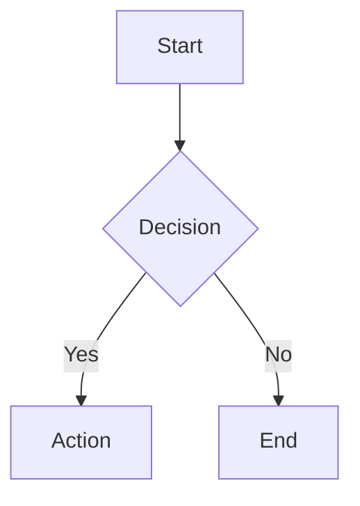
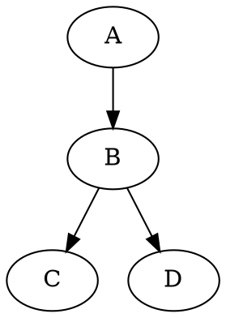

# MarkdownViz

A lightweight, performance-oriented Markdown editor, viewer, and beautifier with multi-tab sessions, diagram support, file conversion, and cloud sync.

## ✨ Features

### Editor & Preview
- **Split-pane editor & preview** — CodeMirror 6 editor with live GitHub-style preview
- **Draggable divider** — Resize editor/preview panes with mouse or touch on all devices
- **Multi-tab editing** — Open multiple files in tabs with session persistence (IndexedDB)
- **Tab rename** — Double-click tab to rename; download uses tab name as filename
- **Distinctive syntax highlighting** — Theme-aware colors for headings, bold, italic, code, strings, keywords, comments, and more
- **Markdown beautifier** — One-click formatting via Prettier (Ctrl+Shift+F)

### Rendering
- **Diagram support** — Mermaid, Graphviz (DOT), and Nomnoml diagrams rendered inline
- **Diagram zoom** — Click any diagram to open a zoom/pan modal; export as PNG or SVG
- **Math rendering** — KaTeX for inline (`$...$`) and block (`$$...$$`) LaTeX math
- **Syntax highlighting** — highlight.js for 190+ languages in code blocks
- **GitHub alerts** — `[!NOTE]`, `[!TIP]`, `[!WARNING]`, `[!IMPORTANT]`, `[!CAUTION]`
- **Emoji shortcodes** — `:rocket:` → 🚀, `:fire:` → 🔥, and more

### Themes (17 built-in)
- **Light**: GitHub Light, Visual Studio, VS Code Light, JetBrains, IntelliJ, Paper, Solarized Light
- **Dark**: GitHub Dark, VS Code Dark+, JetBrains Darcula, One Dark, Dracula, Monokai, Nord, Solarized Dark, Tokyo Night, Catppuccin
- All themes include configurable syntax color variables

### File Import & Export
- **Import** — Drag & drop, file picker, or GitHub raw URL
- **File conversion** — Import PDF, DOCX, DOC, ODT, RTF files with automatic markdown conversion
- **Export** — Download as Markdown, HTML, or PDF

### Mobile & Responsive
- **Settings menu** — Slide-in panel with all features accessible on mobile
- **Responsive toolbar** — Full toolbar on desktop, settings gear on mobile
- **Touch-friendly divider** — Vertical split on mobile with proper touch dragging

### Cloud & Auth
- **Cloud sync** — Firebase Auth (GitHub/Google) + Firestore for cross-device sync
- **Sync limit** — Up to 5 most recent documents synced per account
- **Optional auth** — Works fully offline; sign in only if you want cloud sync
- **Redirect fallback** — Popup auth with automatic redirect fallback for mobile

### Developer Experience
- **Offline-first** — Works without internet; IndexedDB stores everything locally
- **Keyboard shortcuts** — Full set of formatting and navigation shortcuts
- **Lightweight** — Zero-framework (vanilla TypeScript), heavy libs lazy-loaded
- **Comprehensive tests** — 127+ tests: unit, integration, smoke, and regression

## 🚀 Quick Start

```bash
# Install dependencies
npm install

# Start dev server
npm run dev

# Build for production
npm run build

# Preview production build
npm run preview

# Run tests
npm test

# Run tests in watch mode
npm run test:watch

# Run tests with coverage
npm run test:coverage
```

## 🔑 Firebase Setup (Optional)

Cloud sync requires a Firebase project. Without it, the app works fully offline with local storage.

1. Create a project at [Firebase Console](https://console.firebase.google.com/)
2. Enable **Authentication** → Sign-in providers: GitHub, Google
3. Enable **Cloud Firestore** (start in test mode)
4. Register a Web app and copy the config
5. Create `.env.local`:

```env
VITE_FIREBASE_API_KEY=your-api-key
VITE_FIREBASE_AUTH_DOMAIN=your-project.firebaseapp.com
VITE_FIREBASE_PROJECT_ID=your-project-id
VITE_FIREBASE_STORAGE_BUCKET=your-project.appspot.com
VITE_FIREBASE_MESSAGING_SENDER_ID=123456789
VITE_FIREBASE_APP_ID=1:123456789:web:abcdef
```

### Deploy to Firebase Hosting

```bash
npm run build
npx firebase deploy --only hosting
```

## 🎨 Themes

| Theme | Type |
|-------|------|
| GitHub Light | Light |
| Visual Studio | Light |
| VS Code Light | Light |
| JetBrains | Light |
| IntelliJ | Light |
| Paper | Light |
| Solarized Light | Light |
| GitHub Dark | Dark |
| VS Code Dark+ | Dark |
| JetBrains Darcula | Dark |
| One Dark | Dark |
| Dracula | Dark |
| Monokai | Dark |
| Nord | Dark |
| Solarized Dark | Dark |
| Tokyo Night | Dark |
| Catppuccin | Dark |

## 📊 Supported Diagrams

### Mermaid
Flowcharts, sequence diagrams, Gantt charts, class diagrams, state diagrams, ER diagrams, pie charts, and more.

````markdown

````

### Graphviz (DOT)
````markdown

````

### Nomnoml (UML)
````markdown
```nomnoml
[User] -> [Application]
[Application] -> [Database]
```
````

## 📥 Supported Import Formats

| Format | Method |
|--------|--------|
| `.md`, `.markdown`, `.mdx` | Direct load |
| `.txt`, `.text` | Direct load |
| `.pdf` | Text extraction via pdf.js |
| `.docx` | HTML conversion via mammoth.js → markdown |
| `.doc`, `.odt`, `.rtf` | Best-effort text extraction |

## 🛠️ Tech Stack

| Library | Purpose | Loading |
|---------|---------|---------|
| [Vite](https://vite.dev/) | Build tool | Core |
| [TypeScript](https://www.typescriptlang.org/) | Type safety | Core |
| [CodeMirror 6](https://codemirror.net/) | Editor | Bundled |
| [marked](https://marked.js.org/) | Markdown parser | Bundled |
| [DOMPurify](https://github.com/cure53/DOMPurify) | HTML sanitization | Bundled |
| [highlight.js](https://highlightjs.org/) | Syntax highlighting | Lazy |
| [KaTeX](https://katex.org/) | Math rendering | Lazy |
| [Mermaid](https://mermaid.js.org/) | Diagrams | Lazy |
| [@viz-js/viz](https://viz-js.com/) | Graphviz (WASM) | Lazy |
| [nomnoml](https://nomnoml.com/) | UML diagrams | Lazy |
| [Prettier](https://prettier.io/) | Beautifier | Lazy |
| [Firebase](https://firebase.google.com/) | Auth & cloud sync | Lazy |
| [mammoth](https://github.com/mwilliamson/mammoth.js) | DOCX conversion | Lazy |
| [pdfjs-dist](https://github.com/nicnils/pdfjs-dist) | PDF text extraction | Lazy |
| [html2canvas](https://html2canvas.hertzen.com/) | PDF export | Lazy |
| [jsPDF](https://github.com/parallax/jsPDF) | PDF generation | Lazy |
| [Vitest](https://vitest.dev/) | Testing framework | Dev |

## 📱 Responsive Breakpoints

- **Desktop** (>768px): Side-by-side editor + preview with draggable split handle
- **Tablet/Mobile** (≤768px): Stacked layout with settings menu for all features

## ⌨️ Keyboard Shortcuts

| Shortcut | Action |
|----------|--------|
| Ctrl+B | Bold |
| Ctrl+I | Italic |
| Ctrl+K | Insert link |
| Ctrl+N | New tab |
| Ctrl+S | Save to storage |
| Ctrl+Shift+F | Beautify markdown |
| Escape | Close modals |

## 🧪 Testing

```bash
npm test              # Run all tests
npm run test:watch    # Watch mode
npm run test:coverage # With coverage report
```

Tests include:
- **Unit tests**: Event system, state management, themes, icons, beautifier, types
- **Integration tests**: State + events cross-module operations
- **Smoke tests**: Module loading, initialization, Firebase config
- **Regression tests**: Edge cases (empty content, large files, special chars, rapid toggles)

## 📄 License

GNU General Public License v3.0
