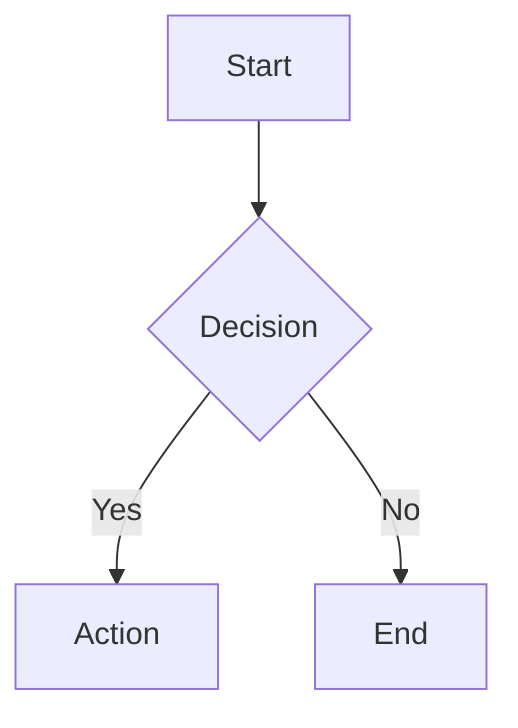
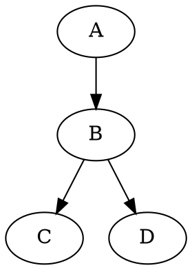

# MarkdownViz

A lightweight, performance-oriented Markdown editor, viewer, and beautifier with multi-tab sessions, diagram support, and cloud sync.

## ✨ Features

- **Split-pane editor & preview** — CodeMirror 6 editor with live GitHub-style preview
- **Multi-tab editing** — Open multiple files in tabs with session persistence (IndexedDB)
- **VS Code-like themes** — 10 built-in themes: GitHub Light/Dark, One Dark Pro, Dracula, Monokai Pro, Nord, Solarized Light/Dark, Tokyo Night, Catppuccin Mocha
- **Diagram support** — Mermaid, Graphviz (DOT), and Nomnoml diagrams rendered inline
- **Diagram zoom** — Click any diagram to open a zoom/pan modal; export as PNG or SVG
- **Math rendering** — KaTeX for inline (`$...$`) and block (`$$...$$`) LaTeX math
- **Syntax highlighting** — highlight.js for 190+ languages in code blocks
- **Markdown beautifier** — One-click formatting via Prettier (Ctrl+Shift+F)
- **GitHub alerts** — `[!NOTE]`, `[!TIP]`, `[!WARNING]`, `[!IMPORTANT]`, `[!CAUTION]`
- **Emoji shortcodes** — `:rocket:` → 🚀, `:fire:` → 🔥, and more
- **Export** — Download as Markdown, HTML, or PDF
- **Import** — Drag & drop, file picker, or GitHub raw URL
- **Cloud sync** — Firebase Auth (GitHub/Google) + Firestore for cross-device sync
- **Offline-first** — Works without internet; IndexedDB stores everything locally
- **Keyboard shortcuts** — Ctrl+B (bold), Ctrl+I (italic), Ctrl+K (link), Ctrl+N (new tab), Ctrl+S (save), Ctrl+Shift+F (beautify)
- **Responsive** — Desktop split-pane, tablet/mobile stacked layout
- **Lightweight** — Zero-framework (vanilla TypeScript), heavy libs lazy-loaded

## 🚀 Quick Start

```bash
# Install dependencies
npm install

# Start dev server
npm run dev

# Build for production
npm run build

# Preview production build
npm run preview
```

## 🔑 Firebase Setup (Optional)

Cloud sync requires a Firebase project. Without it, the app works fully offline with local storage.

1. Create a project at [Firebase Console](https://console.firebase.google.com/)
2. Enable **Authentication** → Sign-in providers: GitHub, Google
3. Enable **Cloud Firestore** (start in test mode)
4. Register a Web app and copy the config
5. Create `.env.local`:

```env
VITE_FIREBASE_API_KEY=your-api-key
VITE_FIREBASE_AUTH_DOMAIN=your-project.firebaseapp.com
VITE_FIREBASE_PROJECT_ID=your-project-id
VITE_FIREBASE_STORAGE_BUCKET=your-project.appspot.com
VITE_FIREBASE_MESSAGING_SENDER_ID=123456789
VITE_FIREBASE_APP_ID=1:123456789:web:abcdef
```

## 🎨 Themes

| Theme | Type |
|-------|------|
| GitHub Light | Light |
| GitHub Dark | Dark |
| One Dark Pro | Dark |
| Dracula | Dark |
| Monokai Pro | Dark |
| Nord | Dark |
| Solarized Light | Light |
| Solarized Dark | Dark |
| Tokyo Night | Dark |
| Catppuccin Mocha | Dark |

## 📊 Supported Diagrams

### Mermaid
Flowcharts, sequence diagrams, Gantt charts, class diagrams, state diagrams, ER diagrams, pie charts, and more.

````markdown

````

### Graphviz (DOT)
````markdown

````

### Nomnoml (UML)
````markdown
```nomnoml
[User] -> [Application]
[Application] -> [Database]
```
````

## 🛠️ Tech Stack

| Library | Purpose | Loading |
|---------|---------|---------|
| [Vite](https://vite.dev/) | Build tool | Core |
| [TypeScript](https://www.typescriptlang.org/) | Type safety | Core |
| [CodeMirror 6](https://codemirror.net/) | Editor | Bundled |
| [marked](https://marked.js.org/) | Markdown parser | Bundled |
| [DOMPurify](https://github.com/cure53/DOMPurify) | HTML sanitization | Bundled |
| [highlight.js](https://highlightjs.org/) | Syntax highlighting | Lazy |
| [KaTeX](https://katex.org/) | Math rendering | Lazy |
| [Mermaid](https://mermaid.js.org/) | Diagrams | Lazy |
| [@viz-js/viz](https://viz-js.com/) | Graphviz (WASM) | Lazy |
| [nomnoml](https://nomnoml.com/) | UML diagrams | Lazy |
| [Prettier](https://prettier.io/) | Beautifier | Lazy |
| [Firebase](https://firebase.google.com/) | Auth & cloud sync | Lazy |
| [html2canvas](https://html2canvas.hertzen.com/) | PDF export | Lazy |
| [jsPDF](https://github.com/parallax/jsPDF) | PDF generation | Lazy |

## 📱 Responsive Breakpoints

- **Desktop** (>768px): Side-by-side editor + preview with resizable split
- **Tablet/Mobile** (≤768px): Stacked editor and preview

## ⌨️ Keyboard Shortcuts

| Shortcut | Action |
|----------|--------|
| Ctrl+B | Bold |
| Ctrl+I | Italic |
| Ctrl+K | Insert link |
| Ctrl+N | New tab |
| Ctrl+S | Save to storage |
| Ctrl+Shift+F | Beautify markdown |
| Escape | Close modals |

## 📄 License

GNU General Public License v3.0
